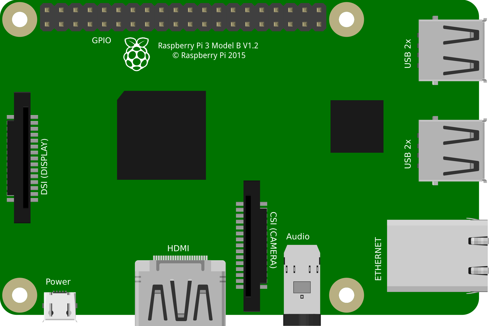

Prysmalight-pi
===========================================

<p align="center">
  
</p>

<p align="center">
  The Docker-compose file to run lightapp2 on your rpi3
</p>

# How to run
- Make sure the Raspberry pi 3 is set up correctly (Section below)
- SSH into your raspberry pi
- Navigate to the lightapp2-pi folder
- Run ```docker-compose up -d``` and it should work
  - Note: This may take a while the first time as it needs to pull the images from docker cloud

# How to Upgrade
- SSH into your raspberry pi
- Navigate to the lightapp2-pi folder
- Run ```docker-compose pull```
  - Note: This may take a while as it needs to pull the images from docker cloud
# How to setup the Raspberry Pi 3
## Change Hostname
- Open Hosts File
  - ```sudo nano /etc/hosts```
  - Change raspberrypi to prysma
- Open Hostname File
  - ```sudo nano /etc/hostname```
  - Change raspberrypi to prysma
  
## Set up Headless Wifi Configuration
- TODO

## Clone the git repo or just download the file
- Update the RPI
  - ```sudo apt-get update```
  - ```sudo apt-get upgrade```
- Install git if you havent already
  - ```sudo apt-get install git```
- Clone the repo
  - ```git clone https://github.com/Rooknj/lightapp2-pi.git```

## Install and setup Docker and Docker-compose
- Install docker using this script
  - ```curl -fsSL get.docker.com -o get-docker.sh && sh get-docker.sh```
- Setup docker for use without having to type in sudo every time
  - ```sudo groupadd docker```
  - ```sudo gpasswd -a $USER docker```
- Either logout and then log back in, or run ```newgrp docker``` for the changes to take effect.
- Test this is working correctly
  - ```docker run hello-world```
- Install docker-compose using pip
  - ```sudo apt install -y python python-pip``` (if pip and python are not installed)
  - ```sudo pip install -U docker-compose```

## Add mDNS advertisement for MQTT server
- Create the file /etc/avahi/services/mqtt.service
- Paste this inside:
```
<?xml version="1.0" standalone='no'?>
<!DOCTYPE service-group SYSTEM "avahi-service.dtd">
<service-group>
 <name replace-wildcards="yes">MQTT on %h</name>
  <service>
   <type>_mqtt._tcp</type>
   <port>1883</port>
  </service>
</service-group>
```
- Reboot to take effect
# Working with homebridge
## We are using homebridge-mqtt to interface with homekit
- Follow the API here: https://www.npmjs.com/package/homebridge-mqtt
- Service and characteristic names defined here : https://github.com/KhaosT/HAP-NodeJS/blob/master/lib/gen/HomeKitTypes.js

## Adding a light to homekit
- Publish this to prysmalight/to/add
```
{
  "name": "<Device ID>",
  "service_name": "<Display Name>",
  "service": "Lightbulb",
  "Brightness": "default",
  "Hue": "default",
  "Saturation": "default"
}
```

## Removing a light from homekit
- Publish this to prysmalight/to/remove
```
{
  "name": "<Device ID>"
}
```

## Add homebridge to homekit
- SSH into your raspberry pi 3
- Navigate to the prysmalight-pi folder
- Run ```docker ps```
- Find the correct container id for the homekit container
- Run ```docker logs <CONTAINER-ID>```
- Find the homekit QR code and add it
